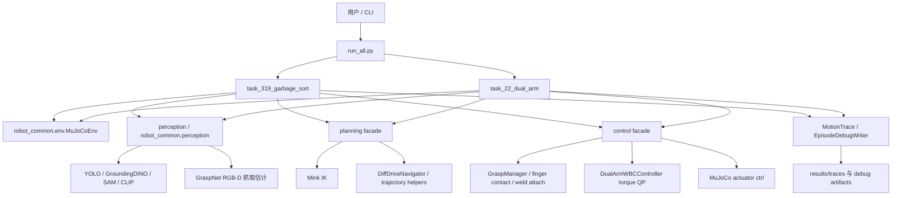
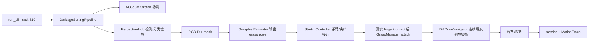
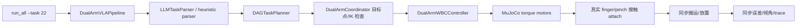

# 项目结构与系统数据流说明

更新时间：2026-06-17

## 0. 当前范围

当前仓库只保留两个有效任务：

- **3.19 Stretch 垃圾分类投放**
- **2.2 双臂协同搬运**

**3.7 Kuavo 开放词汇抓取已经弃用并移除**：任务包、配置、Kuavo 场景资产、Kuavo 标定、Kuavo stance、MoveIt2 配置、MoveIt2 bridge、`run_all.py --task 37` 和健康检查项都不再属于当前系统。

## 1. 总体架构图



## 2. 目录结构

```text
project/
├── run_all.py                       # 统一运行入口：--task 319 / --task 22 / --task all
├── task_319_garbage_sort/           # 3.19 Stretch 垃圾分类投放 pipeline
├── task_22_dual_arm/                # 2.2 双臂协同搬运 pipeline
├── robot_common/
│   ├── env/                         # MuJoCoEnv、相机渲染、RGB-D、世界/相机坐标转换
│   ├── perception/                  # 检测、分割、分类、PerceptionHub
│   ├── decision/                    # TaskRouter、LLMTaskParser、状态机、任务计划数据结构
│   ├── execution/                   # Mink IK、GraspManager、GraspNet adapter、WBC、导航/轨迹工具
│   └── infra/                       # YAML 配置、日志、指标、MotionTrace、debug artifacts
├── perception/                      # 感知层 facade，隔离 pipeline 和底层视觉实现
├── planning/                        # 规划层 facade，暴露 IK、导航、轨迹、碰撞和约束接口
├── control/                         # 控制层 facade，暴露 MuJoCo、夹爪、WBC、末端执行器规格
├── configs/
│   ├── task_319_garbage_sort.yaml
│   ├── task_319_garbage_sort_all.yaml
│   └── task_22_dual_arm.yaml
├── simulation/                      # MuJoCo MJCF/XML 场景和机器人模型
├── scripts/                         # import/health/scene audit/asset setup/WSL helper
├── models/                          # 模型权重，gitignored
├── third_party/                     # GraspNet 等第三方源码，gitignored
├── README.md
├── ROADMAP.md
└── SESSION_SUMMARY.md
```

## 3. 模块职责

| 模块 | 技术/包 | 作用 |
|---|---|---|
| `run_all.py` | argparse、MuJoCo viewer | 统一启动 3.19、2.2 或 active all；负责 viewer/headless、full/light 参数传递 |
| `robot_common.env` | MuJoCo、NumPy | 加载 MJCF、step 仿真、渲染 RGB-D、相机内外参、世界/相机坐标转换 |
| `perception` | facade | 让任务代码通过稳定接口调用感知能力 |
| `robot_common.perception` | YOLO、GroundingDINO、SAM、CLIP | 物体检测、分割、语义分类和多模型封装 |
| `robot_common.execution.grasp_estimators` | GraspNet baseline、graspnetAPI、CUDA ops、WSL bridge | 从 RGB-D 和 mask 估计抓取位姿；full 模式不允许 scene-truth 替代 |
| `planning` | Mink、NumPy | 暴露 IK、导航、轨迹生成、碰撞检测、约束数据结构 |
| `control` | MuJoCo actuator ctrl、WBC QP、GraspManager | 把规划目标变成电机/夹爪/焊接 attach 操作 |
| `robot_common.execution.dual_arm_wbc` | MuJoCo `mj_fullM`、Jacobian、QP/最小二乘 | 2.2 双臂 torque-level WBC，约束左右夹爪相对位姿 |
| `robot_common.infra.motion_trace` | JSON trace | 记录首动时间、base/关节/物体跳变、平滑性、同步误差和倾角 |
| `scripts/verify_system_health.py` | 静态 AST、MuJoCo runtime check | 检查 active 两任务的场景、相机、夹爪、GraspNet、WBC、禁止 teleport |

## 4. 任务入口点

| 任务 | 入口命令 | Pipeline |
|---|---|---|
| 3.19 垃圾分类投放 | `python run_all.py --task 319` | `task_319_garbage_sort.GarbageSortingPipeline` |
| 2.2 双臂协同搬运 | `python run_all.py --task 22 --instruction "用双手把长杆放到指定区域"` | `task_22_dual_arm.DualArmVLAPipeline` |
| 全部 active 任务 | `python run_all.py --task all --headless` | 依次运行 3.19 和 2.2 |

## 5. 3.19 数据流 / 控制流



关键点：

- 感知输出目标类别、mask、目标 3D 点和抓取位姿。
- 控制层使用 Stretch 底盘差速速度和伸缩臂/夹爪 actuator，不允许直接写 `data.qpos` 来伪造导航。
- 成功条件必须包含检测、抓取、导航记录和投放结果。

## 6. 2.2 数据流 / 控制流



关键点：

- `DualArmWBCController` 是 2.2 的核心控制闭环。
- 左右夹爪相对约束、物体倾角、同步误差写入 metrics。
- `l_grasp_pad/r_grasp_pad` 只允许作为非接触视觉标记，成功判定依赖真实 finger/pinch contact。

## 7. ROS2 / MoveIt2 状态

当前 active 系统**不再使用 ROS2 / MoveIt2**。相关 Kuavo MoveIt2 配置和 bridge 已随 3.7 一起移除。

WSL/Docker 仍可用于：

- GraspNet CUDA 扩展
- GraspNet checkpoint/runtime
- robosuite/WBC 依赖隔离

## 8. 验证命令

```powershell
python scripts\verify_imports.py
python scripts\verify_system_health.py --light
python scripts\verify_system_health.py --full
python scripts\audit_scene_integrity.py

python run_all.py --task 319 --headless
python run_all.py --task 22 --headless --instruction "用双手把长杆放到指定区域"
python run_all.py --task all --headless
```

## 9. 真机迁移建议

后续接 Dobot Magician 时，不要把 Dobot 逻辑写进 3.19 或 2.2 pipeline。推荐新增：

```text
control/hardware/dobot_magician.py
planning/dobot_ik.py
configs/dobot_magician.yaml
```

标准接口保持为：

- 输入：目标位姿 `[x, y, z, r]`、夹爪/吸盘命令、速度/加速度限制
- 输出：Dobot 关节轨迹或 SDK 指令
- 调试：先不接视觉，直接给 demo 目标位姿验证 IK 和硬件安全控制
